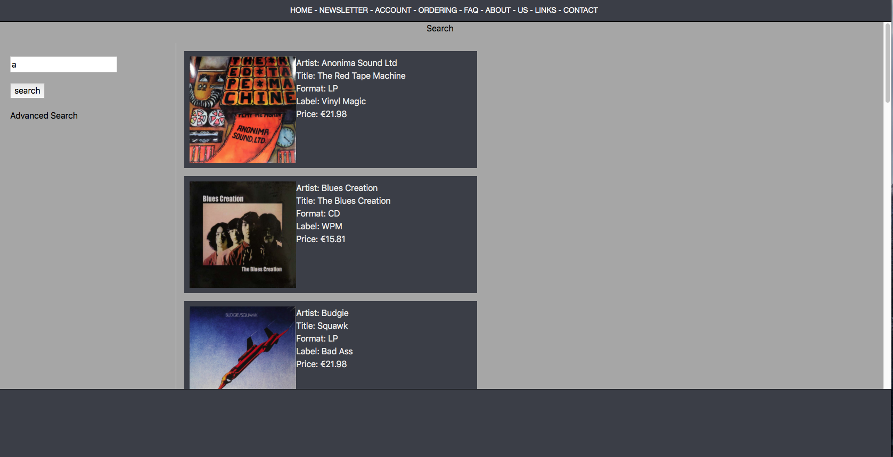

# Prototype E-Commerce Website

A redesign of a record selling website (including Usability and Accessibiliity Report).

### Technologies Used

JavaScript, HTML, CSS, jQuery, WAVE Web Accessibility Evaluation Tool

### Accessibility Report
<!DOCTYPE html>
<html lang="en">
  
<head>
  <meta charset="utf-8">
  <meta name="viewport" content="width=device-width, initial-scale=1">
  <link rel="stylesheet" href="reportStyle.css">
</head>

<body>

  

      

      
This reports contains an assessment of eCommerce website Doug Larson Imports, which provides a visual catalogue of records, CDs and magazines, specialising in vintage and psychadelic recordings from the 1960s and 70s. It contains a substantial database of products which are accessed through various search functionalities. A prototype website was created which seeks to improve on some user design aspects. These changes were based around Schneiderman’s Eight Golden Rules of interface design. [1]

      
<a href="http://www.douglarsonimports.com">Link to website.</a>
       <a href="https://cs1.ucc.ie/~jl25/WebDevelopment/Prototype">Link to prototype</a>

       

      <h3>The Website</h3>

      
The website presents itself as a grid display of products, which are surrounded by clickable categories, search and browse functions. Its functionality centres around content being sorted through an elaborate list of categories, with menus on both left and right sides, along with a large visual array of images in the main content screen. There is also other sections of the website, aside from the puchasing process. These inclued a Frequently Asked Questions (FAQ) section, a section giving some details about the team behind the website, a contact section and a link to external sources of related information. There are also multiple links to shipping and ordering information, along with a personal account section and gift certificates.

       

      
      
Home page of douglarsonimports.com

      <h3>The Prototype</h3>

      
The prototype website aims to simplify the original website, both visually and funtionally. The amount of information and choices apparent on each screen display is reduced and streamlined into a more gradual process based approach. Interactive elements are introduced, such as a clickable map.

       

      <h3>Usability</h3>

      
Upon loading the home page, the user is faced with a large amount of information and choices. Some of these choices are repeated on the same page, for example the <i>featured artist</i> section is presented on the centre content section in addition to the right side menu bar. This is an example of redundency in user design.

      
In order to address this surplus of information I created the following tree structure to divide the webpage into sections that followed a logical flow of information retrieval. The tree begins with broader decision categories, such as whether the user wishes to search for a specific item or to browse. As the user moves down the navigation tree, the choices become increasingly specified. The sections in bold are functionally represented in the prototype.

       

      

      
Tree map image

       

      
The first of Schneiderman’s golden rules aims for consistency. In my prototype I aimed to keep the colour scheme (grey, white and black) consistent with the original website. I also maintained a structural similarity across different pages. The style and positioning of the menu bar is maintained from the original website.

       

      <h3>Accessibility</h3>

      
Schneiderman’s second golden rule aims for univeral usability across various ages and levels of expertise, and taking into account users with special needs. With this in mind I tried to keep the website’s operation as simple as possible, drawing users through the purchasing process one step at a time, as opposed to immediately confronting them with an overwhelming amount of options.

      
I used the WAVE online web accessibility tool to assess the Doug Larson website. The website detected the following errors in the home page alone:

       

      
      
Error detection from the WAVE Web Accessibility Tool

       

      
The test produced 239 errors whereby adjacent links pointed to the same destination. This repetition and redundancy was avoided with the prototype website, through containing all product information inside a single clickable &lt;div&gt; element.

      
Some of the images had no alternative text, this means that blind users have no way of determinig the function of the image. Another issue was alternative text being too long. For users using a screen reader, cycling through these texts to find desired content would be time consuming.

      
To combat these issues, the prototype contains aria-labelledby tags and alt tags to explain images and divs. The original website performed well in an assessment of text/background contrast. This element is important for partially sighted users who may have difficulty discerning subtle colour differences.

      
The prototype utilised iframes to create the main website divisions across the screen. This can pose problems for accessibility as it means that individual sections do not have a RESTful url. Were the prototype to be developed, a more semantic-friendly content management system would be utilised.

       

      <h3>Technical Implementation</h3>

      
Schneiderman’s third rule calls for informative feedback which show the result of their actions. The prototype contains certain technical implementations that seek to give the user immediate feedback along the purchasing process. An interactive map shows a list of relevant products when the user clicks on a certain section of a world map.

      
For blind users, the text based search box is maintained from the original website.

       

      <h3>Appearance</h3>

      
The colour scheme is carried over from the original website so as not to alienate regular customers. The sense of familiarity is important for establishing a sense of trust between customer and supplier. The prototype aims to maintain a degree of this comfortable familiarity whilst introducting new functionality. 

      
I used wireframing website wireframe.cc to create a mockup of the eventual layout of the prototype.

       

      
      
Wireframe of prototype design

      
I used logo making website <a href="http://hatchful.shopify.com">hatchful.shopify.com</a> to create a logo. This serves as the website’s identity. The two colour tones from the logo are carried over acoss the website to achieve a sense of consistency.

      
      
Prototype logo.

      
The navigation bar along the top of the screen was maintained from the original website. However, the number of options were reduced and simplified, with related sections being contained as sub-sections under a single grouping. The prototype also contains a bottom section of only black colour, this gives a constant sense of space to the browsing experience. This is to contrast to the cluttered appearance of the original website.

      
      
Use of black space in prototype website.

      <h3>Interaction Widgets</h3>

      
The javascript library jQuery allows for easy communication between document object model tree elements. Its event handlers and Ajax compatibility makes jQuery an important tool for responsive user experiences. In the prototype website, jQuery was used to traverse a json database object contining information on all products.  The search bar uses DOM tree traversal to update the content area with items from an external json file. This allows responsive display of information in real time, depending on what action is taken by the user. Checkboxes, a price slider and an interactive map are also incorparated into the advanced search section.

      
HTML5 allows for increased interactivity through its tools for semantic markup. tags such as &lt;header&gt;, &lt;footer&gt; and &lt;nav&gt; allow for a significan departure from traditional static website presentation.
        

      <h3>Functionality</h3>

      
Schneiderman’s fourth rule calls for design closure, whereby a process has a beginning, middle and end. In the original website the searching and buying processes were mixed in the same website section. The prototype aims to guide the user through the purchase process through a succession of screens. One factor that can clarify this process even further is the introduction of a navigation bar which keeps users informed as to which step of the process they are currently engaged.

      
Schneiderman’s fifth rule aims to eliminate errors on the part of the user. There should be no illegal action. In the prototype search function, an else statement was used to avoid repetition in the presentation of the product list.

      
Schneiderman’s seventh rule states that the user should feel that tey are in charge, an internal locus of control. Te reduced amount of choices to be made per page in the prototype give the customer a clear direction in which to move with respect to the purchasing process.

      
Rule number eights aims to reduce short term memory use by the user. This can be achieved through presenting information on screen as opposed to stored in the user’s short term memory. The stepwise progress bar can avoid the user becoming lost in what step of the action they are currently in.

       

      <h3>Note</h3>

      
At the time of submission, the prototype slider was invisible on the webpage. It is there and can be moved, and can be found in the Price section of the advanced search page.

      <h3>References</h3>

      
[1] Schneiderman’s Eight Golden Rules  
      Retrieved from: https://faculty.washington.edu/jtenenbg/courses/360/f04/sessions/schneidermanGoldenRules.html

        

      

          <footer>
              

              
Report written by John Linnane 2019.  
              Contact: 118227214@umail.ucc.ie

              

          </footer>

  
 <!-- textContainer -->

</body>
</html>

